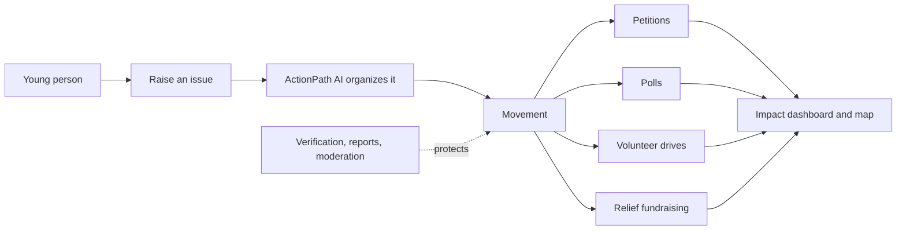
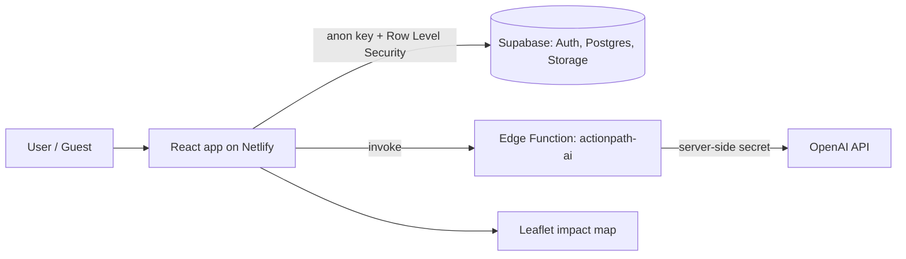

# ForFuture

### The civic action platform built for the next generation.

**Raise it. Rally it. Resolve it.**
Young people turn social concerns into organized, measurable action, in their own language.

[**Live product**](https://fforfuture.netlify.app) · · [**How it works**](https://fforfuture.netlify.app/how-it-works) ·

`React 19` · `TypeScript` · `Supabase` · `Edge Functions + AI` · `English / සිංහල / தமிழ்`

> Built by AhamedNusaif

---

## The problem

Young people are the most connected generation in history, and the most likely to say they want to change their communities. But between a post and a real result there is a gap:

- **Talk doesn't become action.** Concerns get shared and forgotten. Petitions, polls, volunteer drives and fundraisers live on separate tools that don't connect.
- **Many voices stay silent.** Fear of backlash keeps young people from speaking up under their own name.
- **Trust is low.** Donors and volunteers can't tell which campaigns are real, and organizers can't show their results.
- **Local languages are left out.** Most civic tools are English-only, which shuts out millions of Sinhala and Tamil speakers.

## Our solution

ForFuture is one platform that takes a concern from **idea to impact**:

1. **Raise** an issue, anonymously if needed.
2. **Organize** it into a movement with the help of AI.
3. **Mobilize** support through petitions, polls, volunteer drives and fundraising.
4. **Prove** the result on a public impact dashboard and map.

Safety is built in. Verification, reports, moderation and trust review keep the community honest.

---

## Try the product

**Live product: https://fforfuture.netlify.app**

No account is needed to explore. **Discover**, **Movements**, **Relief Hub** and **Polls** are open to guests. To see everything, use a test account:

| Role  | Email                    | Password    |
|-------|--------------------------|-------------|
| User  | `demo.user@example.com`  | `CHANGE-ME` |
| Admin | `demo.admin@example.com` | `CHANGE-ME` |

**A 2-minute tour**

1. Open **Discover** as a guest and browse live movements.
2. Log in and open the **Feed**.
3. Start a movement and let **ActionPath AI** sharpen the title and description.
4. Vote in a **poll** and sign a **petition**.
5. Open **Impact** for the Youth Impact Pulse dashboard and the impact map.
6. Switch the language to **සිංහල** or **தமிழ்**.
7. Log in as admin and review a report in the **moderation** tools.

---

## Product

| | Pillar | What it does |
|---|--------|--------------|
| 📣 | **Youth Voice** | Anonymous posting with a Youth Voice ID, so people can speak up safely |
| 🚩 | **Movements** | Browse, filter, search and support causes, with full movement pages |
| ✍️ | **Petitions** | Create, sign and track support in real time |
| 🗳️ | **Polls** | One vote per user, with live results |
| 🤝 | **Volunteer drives** | Organize civic actions with event details and participation |
| 💛 | **Relief hub** | Fundraising and relief campaigns with trust-review hooks |
| 🤖 | **ActionPath AI** | Turns a rough idea into a clear title, copy and movement structure |
| 📊 | **Impact** | Youth Impact Pulse dashboard and an impact map |
| 🌍 | **Discover** | A public hub that lets guests explore before signing up |
| 🛡️ | **Trust and safety** | Verification, reports, moderation and trust review for admins |
| 🗣️ | **Multi-language** | English, Sinhala and Tamil built in |
| 📱 | **Responsive** | Works on desktop and mobile |

### Screenshots

| Home | Feed |
|------|------|
|  |  |

| Impact Pulse | Impact Map |
|--------------|------------|
|  |  |

---

## How it works

### Architecture

The app is built for safety and scale from the start:

- **Security by design.** The browser only uses the public anon key, and Row Level Security controls access to every record. The AI key lives only in server-side Edge Function secrets.
- **Serverless and low-cost.** A static front end on Netlify and a managed Supabase backend mean there are no servers to run, and it scales with usage.
- **Fast.** Route-level code splitting keeps the first load small.
- **Tested.** Vitest and React Testing Library cover filters, auth validation and protected routes.

---

## Who it's for

| Audience | What they get |
|----------|---------------|
| **Students and young citizens** | A safe place to raise issues and organize |
| **Volunteers** | Drives and campaigns they can trust and join |
| **Community organizers and NGOs** | Tools to mobilize supporters and show results |
| **Schools and universities** | A way to channel student energy into real projects |
| **Donors and supporters** | Verified campaigns and visible impact |

## Global goals

ForFuture supports the United Nations Sustainable Development Goals, in particular:

**SDG 4** Quality Education · **SDG 10** Reduced Inequalities · **SDG 11** Sustainable Cities and Communities · **SDG 16** Peace, Justice and Strong Institutions · **SDG 17** Partnerships for the Goals

---

## Traction

*Replace these with your real numbers before submitting. Leave out anything you can't back up.*

| Metric | Value |
|--------|-------|
| Movements created | _N_ |
| Petition signatures | _N_ |
| Volunteers joined | _N_ |
| Users / testers | _N_ |
| Languages supported | 3 |

---

## Vision and roadmap

**Vision:** a world where every young person has the tools to turn a concern into a result.

| Stage | Focus |
|-------|-------|
| **Now** | A working platform with movements, petitions, polls, drives, relief, AI help, impact tracking and moderation in three languages |
| **Next** | Pilots with schools, universities and youth organizations. Notifications and sharing. Richer impact reports that can be exported. More local campaign categories |
| **Later** | More languages and countries. Partnerships with NGOs and local institutions. Public APIs and open impact data. Mobile apps |

**Sustainability ideas under consideration:** institutional plans for schools and NGOs, sponsored verified campaigns, and grants from civic-tech and education programs. The core tools for young people stay free.

---

## Trust, privacy and safety

- Anonymous posts use a **Youth Voice ID** instead of a real name.
- **Reports, moderation and trust review** give admins tools to handle abuse and verify campaigns.
- **Row Level Security** protects data at the database level.
- **No secrets in the frontend.** The AI key is stored only in server-side secrets.
- Legal pages are included: Privacy Policy, Terms of Use and Community Guidelines.

Security contact: **YOUR EMAIL**

---

## Team

| Name | Role |
|------|------|
| AhamedNusaif | Founder, developer and designer ([Linkdin](www.linkedin.com/in/ahamed-nusaif)) |

---

**ForFuture** · Released under the [MIT License](LICENSE)

